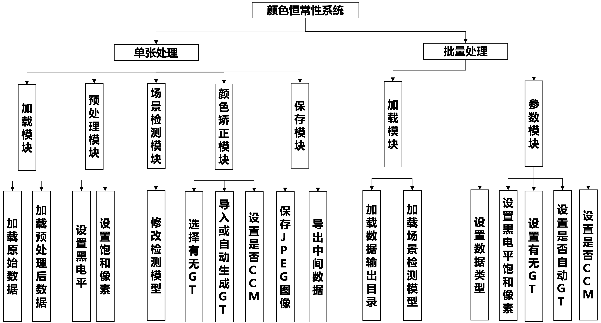

# AWB-tools

自动白平衡（AWB）旨在校正图像中的颜色偏差，以确保白色看起来真正的白色，而不受光源的影响。

作为ISP子阶段之一， AWB算法通常嵌入硬件，对算法人员不友好；手机 AWB 算法对于复杂困难场景颜色还原不准(尤其纯色背景图像效果极差)。

针对上述问题，我们用Python实现了困难场景下的AWB算法的仿真系统。

## 演示demo

## 软件架构

流程：RAW图像读取 --> 预处理 --> 场景检测 ---> AWB( GT 评估) --> CCM --> 保存

## 主要功能

1. 渲染

   （1）预处理：去马赛克、去黑白电平……

​	（2）纯色背景的场景检测：随机森林等多分类模型供选择

​	（3）AWB算法渲染

2. 评估

   （1）对带有colorchecker的图像自动生成光照GT

​	（2）带GT 的 指标评估：MAE、PSNR

3. 中间数据的导出：光照增益、预处理图像数据……
4. 单图像处理和批量处理

# 主要环境和库

* Python 3.8
* cuda 10.0
* PyQt5 5.1
* torch 1.8.1
* torchvision 0.9.1

……

## 最后

由于实验室要求保密，目前代码暂时无法释放，先放个演示，后续再议……

